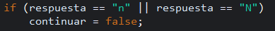
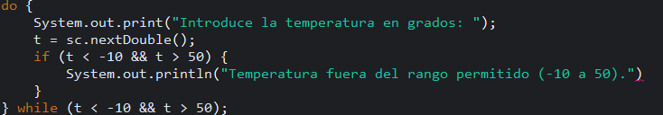

# Practica 6: Depura y corrige los errores

## Faltas de punto y coma (;)
En varias líneas del código faltaban los puntos y coma al final de las instrucciones.
Esto provoca errores de compilación, ya que Java requiere el punto y coma para indicar el final de cada sentencia.

Como este ejemplo hay muchos otros


Solución:
```
mostrarMensajeBienvenida(); // AMC20252410: Falta poner punto y coma
```

## El formato en String de la condición para salir del bucle
Al depurar el programa con un punto de ruptura en la línea del if, observé en la vista que la condición nunca se cumplía, aunque el usuario introdujera "n" o "N".

Esto ocurría porque se estaba usando == con Strings. Para solucionarlo, tomé el primer carácter del String con charAt(0) y uso las comillas simples 'n' y 'N':

Ejemplo:



Solución:
```
if (respuesta.charAt(0) == 'n' || respuesta.charAt(0) == 'N') { // AMC20252410: Cambiamos a char, y le ponemos las comillas simples
    continuar = false;
}
```

## Cambiar && por || en el bucle de la temperatura fuera de rango
Al depurar el programa con un punto de ruptura dentro del bucle do-while y observando la variable t, noté que la condición nunca se cumplía, porque ningún número puede ser menor que -10 y mayor que 50 al mismo tiempo.

Para solucionarlo, cambié el operador && por ||, de forma que la condición se pudiera cumplir correctamente, ya que era una condición imposible de cumplir

Ejemplo:



Solución:
```
do {
    System.out.print("Introduce la temperatura en grados: ");
    t = sc.nextDouble();
    if (t < -10 || t > 50) { // AMC20252410: Cambiamos && por ||, ya que si no, es una condición imposible
        System.out.println("Temperatura fuera del rango permitido (-10 a 50)."); // Falta poner punto y coma
    }
} while (t < -10 || t > 50); // AMC20252410: Cambiamos && por ||, ya que si no, es una condición imposible
```

## ¿Piensas que la documentación de un programa es necesaria?
Sí, la documentación es fundamental, ya que facilita que otras personas puedan comprender, utilizar y mantener nuestro programa en el futuro.

Además, nos ayuda a nosotros mismos en proyectos grandes a identificar partes complejas del código, entender la lógica detrás de ciertas implementaciones y localizar posibles errores de manera más rápida y eficiente.

Una buena documentación también permite que el desarrollo sea más ordenado y reduce el riesgo de cometer errores al modificar o ampliar el programa.